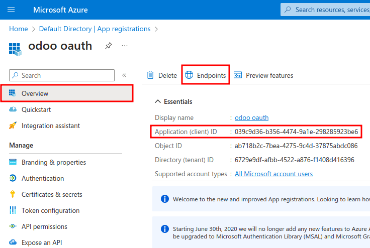
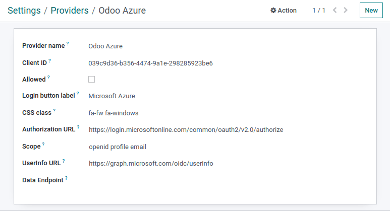
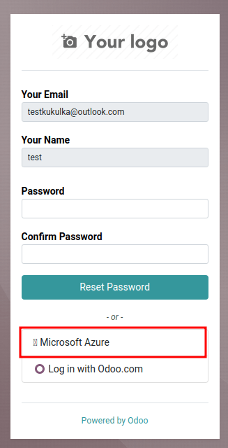
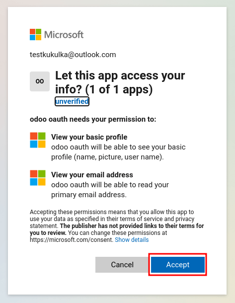

======================================
Microsoft Azure sign-in authentication
======================================

The Microsoft Azure OAuth sign-in authentication is a useful function that allows Odoo users to sign
in to their database with their Microsoft Azure account.

This is particularly helpful if the organization uses Azure Workspace, and wants employees within
the organization to connect to Odoo using their Microsoft Accounts.

.. warning::
   Databases hosted on Odoo.com should not use Oauth login for the owner or administrator of the
   database as it would unlink the database from their Odoo.com account. If Oauth is set up for that
   user, the database will no longer be able to be duplicated, renamed or otherwise managed from
   the Odoo.com portal.

.. seealso::
   - :doc:`../../productivity/calendar/outlook`
   - :doc:`/administration/maintain/azure_oauth`

Configuration
=============

The integration of the Microsoft sign-in function requires configuration both on Microsoft and Odoo.

Odoo System Parameter
---------------------

First activate the :ref:`developer mode <developer-mode>`, and then go to :menuselection:`Settings
--> Technical --> System Parameters`.

Add in the following system parameter: `auth_oauth.authorization_header` and set the value to
`1`.

Microsoft Azure dashboard
-------------------------

Create a new application
~~~~~~~~~~~~~~~~~~~~~~~~

To get started, go to `Microsoft's Azure Portal <https://portal.azure.com/>`_. Log in with the
:guilabel:`Microsoft Outlook Office 365` account if there is one, otherwise log in with the
personal :guilabel:`Microsoft account`. A user with administrative access to the Azure Settings
will need to connect and perform the following configuration. Next, navigate to the section
labeled :guilabel:`Manage Azure Active Directory`.

Now, click on :guilabel:`Add (+)`, located in the top menu, and then select :guilabel:`App
registration`. On the :guilabel:`Register an application` screen, rename the :guilabel:`Name` to
`Odoo` or something recognizable. Under the :guilabel:`Supported account types` either the selection
for personal accounts or enterprise access (only users from the companies directory) can be
selected. To include both select :guilabel:`Accounts in any organizational directory (Any Azure AD
directory - Multitenant) and personal Microsoft accounts (e.g. Skype, Xbox)`.

Under the :guilabel:`Redirect URL` section, select :guilabel:`Web` as the platform, and then input
`https://<odoo base url>/auth_oauth/signin` in the :guilabel:`URL` field. The Odoo base
:abbr:`URL (Uniform Resource Locator)` is the canonical domain at which your Odoo instance can be
reached (e.g. mydatabase.odoo.com if you are hosted on Odoo.com) in the :abbr:`URL (Uniform Resource
Locator)` field. Then, click :guilabel:`Register` and the application is created.

Authentication
~~~~~~~~~~~~~~

Edit the new app's authentication by clicking on :guilabel:`Authentication` after being redirected
to the application's settings from the previous step.

Select the *tokens* that should be issued by the authorization endpoint by scrolling down the screen
and check the boxes labeled: :guilabel:`Access tokens (used for implicit flows)` and :guilabel:`ID
tokens (used for implicit and hybrid flows)`.

.. image:: azure/authentication-tokens.png
   :align: center
   :alt: Authentication settings and endpoint tokens.

Click :guilabel:`Save` to ensure these settings are saved.

Gathering credentials
~~~~~~~~~~~~~~~~~~~~~

Next, click on the :guilabel:`Overview` menu item in the left hand column. Select and copy the
:guilabel:`Application (client) ID`. Paste this credential to a clipboard/notepad as this credential
will be used in the Odoo configuration later.

After finishing this step, click on :guilabel:`Endpoints` on the top menu and click the *copy icon*
next to :guilabel:`OAuth 2.0 authorization endpoint (v2)`.

The value should equal `https://login.microsoftonline.com/common/oauth2/v2.0/authorize`. Replace the
`common` with the :guilabel:`Directory (tenant) ID` under the :guilabel:`Essentials` section of the
Overview page.

.. example::
   Should the :guilabel:`Directory (tenant) ID` be equal to `6729e9df-afbb-4522-a876-e1408d416396`
   then the new value of the :guilabel:`OAuth 2.0 authorization endpoint (v2)` :abbr:`URL (Uniform
   Resource Locator)` should be:
   `https://login.microsoftonline.com/6729e9df-afbb-4522-a876-e1408d416396/oauth2/v2.0/authorize`.

Odoo setup
----------

Navigate to :menuselection:`Settings --> Integrations --> Oauth Authentication` and check the box to
activate the Oauth login feature. Click :guilabel:`Save` to ensure the progress is saved. Sign into
database once the login screen loads.

Navigate back to :menuselection:`Settings --> Integrations --> Oauth Authentication` and click on
:guilabel:`Oauth Providers`. Next, select :guilabel:`New` and name the provider `Azure`.

Paste the :guilabel:`Application (client) ID` from the previous section into the :guilabel:`Client
ID` field. After completing this, paste the new :guilabel:`OAuth 2.0 authorization endpoint (v2)`
value into the :guilabel:`authorization URL` field.

For the :guilabel:`UserInfo URL` field, paste the following :abbr:`URL (Uniform Resource Locator)`:
`https://graph.microsoft.com/oidc/userinfo`

In the :guilabel:`Scope` field, paste the following value: `openid profile email`. Next, the
Windows logo can be used as the CSS class by entering the following value (`fa-fw fa-windows`) in
the :guilabel:`CSS class` field.

Check the box next to the :guilabel:`Allowed` field to enable the Oauth provider. Finally add
`Microsoft Azure Login` to the :guilabel:`Login button label` field.

:guilabel:`Save` the changes should this step be required by the version of Odoo.

User experience flows
---------------------

To sign-in using the Microsoft Azure Oauth provider navigate to the Odoo database login page and
click on the option labeled :guilabel:`Microsoft Azure Login`. The page will redirect to the
Microsoft login page.

Enter the :guilabel:`Microsoft Email Address` and click :guilabel:`Next`. Follow the process to
sign-in to the account. Should :abbr:`2FA (Two Factor Authentication)` be turned on an extra step may
be required.

.. image:: azure/login-next.png
   :align: center
   :alt: Enter Microsoft login credentials.

Finally after logging into the account the page will redirect to a permissions page where the user
will be prompted to :guilabel:`Accept` the conditions that the Odoo application will access their
Microsoft information.

