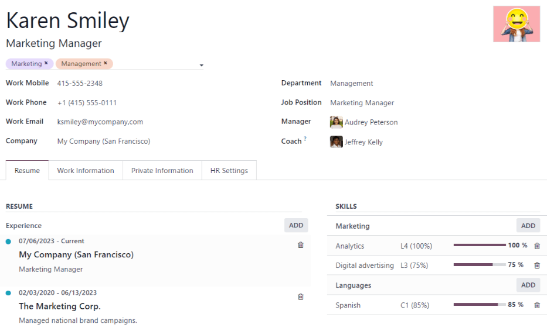
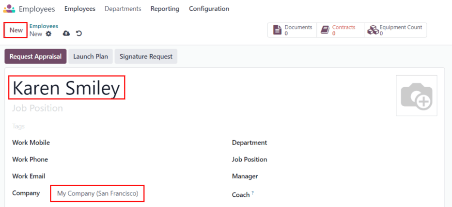
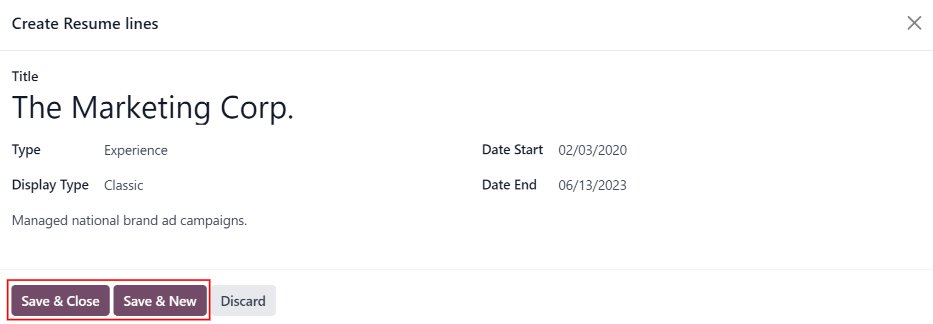
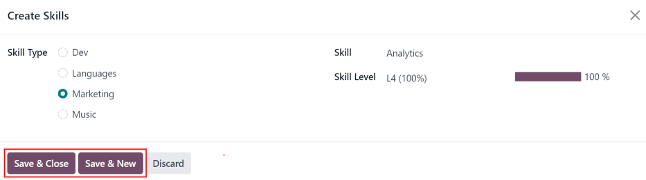
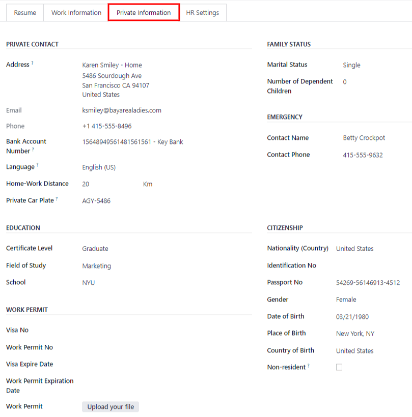
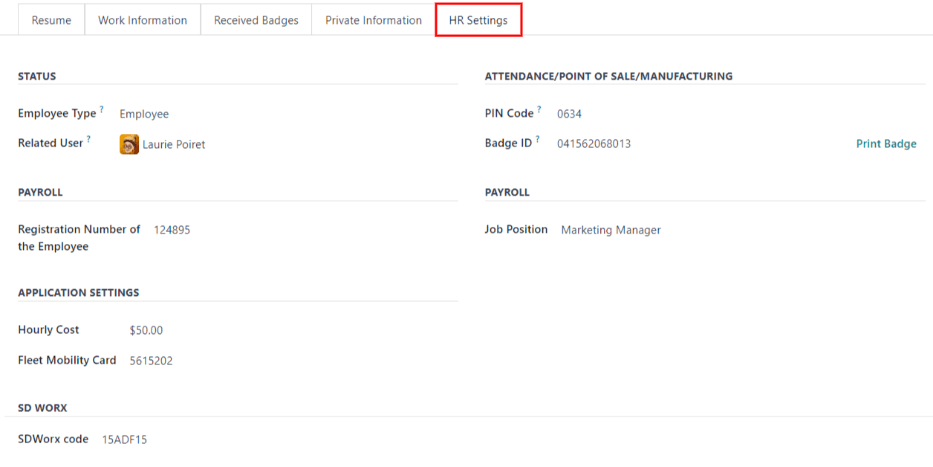
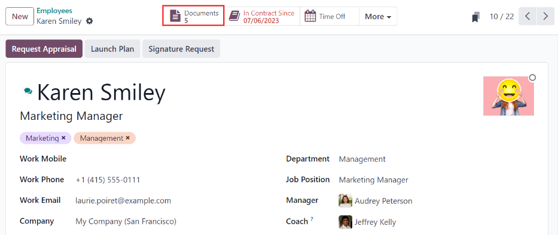

==================
Add a new employee
==================

When a new employee is hired, the first step is to create a new employee form. Starting in the
:menuselection:`Employees` app default view, click the :guilabel:`New` button to access a new
employee form. Fill out the required information (underlined in bold) and any additional details.

.. note::
   The current company phone number and name is populated in the :guilabel:`Work Phone` and
   :guilabel:`Company` fields.

General information
===================

Required fields
---------------

- :guilabel:`Name`: Enter the employee's name.
- :guilabel:`Company`: Select the company from the drop-down menu that the new employee is hired by,
  or create a new company by typing the name in the field.

Optional fields
---------------

- :guilabel:`Photo`: In the top right image box of the employee card, click on the :guilabel:`✏️
  (pencil)` edit icon to select a photo to upload.
- :guilabel:`Job Position`: Enter the employee's job position title.
- Tags: Click on a tag in the drop-down menu to add any tags applicable to the employee. Any tag can
  be created in this field by typing it in. Once created, the new tag is available for all employee
  cards. There is no limit to the amount of tags that can be added.
- Work Contact Information: Enter the employees :guilabel:`Work Mobile`, :guilabel:`Work Phone`,
  :guilabel:`Work Email`, and/or :guilabel:`Company` name.
- :guilabel:`Department`: Select the employee's department from the drop-down menu.
- :guilabel:`Manager`: Select the employee's manager from the drop-down menu.
- :guilabel:`Coach`: Select the employee's coach from the drop-down menu.

.. note::
   After a :guilabel:`Manager` is selected, if the :guilabel:`Coach` field is blank, the selected
   manager automatically populates the :guilabel:`Coach` field.

.. tip::
   To make edits to the selected :guilabel:`Department`, :guilabel:`Manager`, :guilabel:`Coach`, or
   :guilabel:`Company`, click the :guilabel:`External Link` button next to the respective selection.
   The :guilabel:`External Link` button opens the selected form, allowing for modifications. Click
   :guilabel:`Save` after any edits are made.

Additional information tabs
===========================

Resumé tab
----------

Resumé
~~~~~~

Next, the employee's work history is entered in the :guilabel:`Resumé` tab. Each previous experience
must be entered individually. Click :guilabel:`Create a new entry`, and the :guilabel:`Create Resumé
lines` form appears. Enter the following information, then click the :guilabel:`Save & Close` button
if there is only one entry to add, or click the :guilabel:`Save & New` button to save the current
entry and create another line.

- :guilabel:`Title`: Type in the title of the previous work experience.
- :guilabel:`Type`: From the drop-down menu, select either :guilabel:`Experience`,
  :guilabel:`Education`, :guilabel:`Side Projects`, :guilabel:`Internal Certification`,
  :guilabel:`Completed Internal Training`, or type in a new entry.
- :guilabel:`Display Type`: Select either :guilabel:`Classic`, :guilabel:`Certification`, or
  :guilabel:`Course` from the drop-down menu.
- :guilabel:`Date Start` and :guilabel:`Date End`: Enter the start and end dates for the work
  experience. To select a date, use the :guilabel:`< (left)` and :guilabel:`> (right)` arrow icons
  to scroll to the desired month, then click on the day to select it.
- :guilabel:`Description`: Enter any relevant details in the field.

.. note::
   After the new employee form is saved, the current position and company is automatically added to
   the :guilabel:`Resumé` tab, with the end date listed as *current*.

Skills
~~~~~~

An employee's skills can be entered in the :guilabel:`Resumé` tab in the same manner a resumé line
is created. Click the :guilabel:`Create a new entry` button under :guilabel:`Skills` and a
:guilabel:`Create Skills` form appears. Fill in the information, then click the :guilabel:`Save &
Close` button if there is only one entry to add, or click the :guilabel:`Save & New` button to save
the current entry and immediately create a new entry.

- :guilabel:`Skill Type`: Select a :ref:`skill type <employees/skill-types>` by clicking the radio
  button next to the skill type.
- :guilabel:`Skill`: The corresponding skills associated with the selected :guilabel:`Skill Type`
  appear in a drop-down menu. For example, selecting :guilabel:`Language` as the :guilabel:`Skill
  Type` presents a variety of languages to select from under the :guilabel:`Skills` field. Select
  the appropriate pre-configured skill, or type in a new one.
- :guilabel:`Skill Level`: Pre-defined skill levels associated with the selected :guilabel:`Skill
  Type` appear in a drop-down menu. Select a skill level, then the progress bar automatically
  displays the pre-defined progress for that skill level. Skill levels and progress can be modified
  in the :guilabel:`Skill Level` pop-up form, which is accessed via the :guilabel:`External Link`
  button next to :guilabel:`Skill Level` field.

To delete any line from the :guilabel:`Resumé` tab, click the :guilabel:`🗑️ (trash can)` delete
icon to delete the entry. Add a new line by clicking the :guilabel:`ADD` button next to the
corresponding section.

.. _employees/skill-types:

Skill Types
***********

In order to add a skill to an employee's form, the :guilabel:`Skill Types` must be configured. Go to
:menuselection:`Employees app --> Configuration --> Skill Types` to view the currently configured
skill types and create new skill types. Click :guilabel:`New` and a new :guilabel:`Skill Type`
form appears. Fill out all the details and then click :guilabel:`Save`. Repeat this for all the
skill types needed.

- :guilabel:`Skill Type`: Enter the name of the skill type. This should be somewhat generic, since
  the specific skills listed will be housed under this category.
- :guilabel:`Skills`: Click :guilabel:`Add a line` and enter the name for the new skill, then repeat
  for all other needed skills.
- :guilabel:`Levels`:  Click :guilabel:`Add a line` and a :guilabel:`Create Levels` form appears.
  Enter the name of the level, and assign a :guilabel:`Progress` percentage (0-100) for that level.
  Click :guilabel:`Save & New` to save the entry and add another level, or click :guilabel:`Save &
  Close` to save the level and close the form.

  .. example::
     To add a math skill set, enter `Math` in the :guilabel:`Name` field. Next, in the
     :guilabel:`Skills` field, enter `Algebra`, `Calculus`, and `Trigonometry`. Last, in the
     :guilabel:`Levels` field enter `Beginner`, `Intermediate`, and `Expert`, with the
     :guilabel:`Progress` listed as `25`, `50`, and `100`, respectively. Then, either click
     :guilabel:`Save & Close` or :guilabel:`Save & New`.

       .. image:: new_employee/math-skills.png
          :align: center
          :alt: Add new math skills and levels with the skill types form.

Work information tab
--------------------

- :guilabel:`Location`: Select the :guilabel:`Work Address` and :guilabel:`Work Location` from the
  corresponding drop-down menus. The work address :guilabel:`Internal Link` button opens up the
  selected company form in a window, and allows for editing. The :guilabel:`Work Location` is the
  specific location details, such as a floor, or building. If a new work location is needed, add the
  location by typing it in the field.
- :guilabel:`Approvers`: Using the drop-down menus, select the employees responsible for approving
  :guilabel:`Expenses`, :guilabel:`Time Off`, and :guilabel:`Timesheets` for the employee. The
  :guilabel:`Internal Link` button opens a form with the approver's :guilabel:`Name`,
  :guilabel:`Email Address`, :guilabel:`Company`, :guilabel:`Phone`, and :guilabel:`Mobile` fields.
  These can be modified, if needed.
- :guilabel:`Schedule`: Select the :guilabel:`Working Hours` (required) and :guilabel:`Timezone` for
  the employee. The :guilabel:`Internal Link` button opens up a detailed view of the specific daily
  working hours. Working hours can be modified or deleted here.
- :guilabel:`Planning`: Click on a role from the drop-down menu for both the :guilabel:`Roles` and
  the :guilabel:`Default Role` fields to add a role. There is no limit to the amount of
  :guilabel:`Roles` that can be selected for an employee, but there can only be one
  :guilabel:`Default Role`. The default role is the *typical* role that the employee performs, where
  the :guilabel:`Roles` are *all* the specific roles the employee is able to perform.

  .. image:: new_employee/work-info.png
     :align: center
     :alt: Add the work information to the Work Information tab.

.. note::
   :guilabel:`Working Hours` are related to a company's working times, and an employee cannot have
   working hours that are outside of a company's working times.

   Each individual working time is company-specific, so for multi-company databases, each company
   needs to have its own working hours set.

   If an employee's working hours are not configured as a working time for the company, new working
   times can be added, or existing working times can be modified. To add or modify a working time,
   go to the :menuselection:`Payroll app --> Configuration --> Working Times`, and add a new working
   time or edit an existing one.

   After the new working time is created, set the working hours for the employee.

Private information tab
-----------------------

No information in the :guilabel:`Private Information` tab is required, however, some information in
this section may be critical for the company's payroll department. In order to properly process
payslips and ensure all deductions are accounted for, the employee's personal information should be
entered.

Here, the employee's :guilabel:`Private Contact`, :guilabel:`Education`, :guilabel:`Work Permit`,
:guilabel:`Family Status`, :guilabel:`Emergency Contact`, and :guilabel:`Citizenship` information is
entered. Fields are entered either using a drop-down menu, clicking a check box, or typing in the
information.

- :guilabel:`Private Contact`: Enter the personal :guilabel:`Address` for the employee. The
  selection can be made with the drop-down menu. If the information is not available, type in the
  name for the new address. To edit the new address, click the :guilabel:`Internal Link` button to
  open the address form. On the address form, enter or edit the necessary details. Some other
  information in the :guilabel:`Private Contact` section may auto-populate, if the address is
  already listed in the drop-down menu. Enter the employee's :guilabel:`Bank Account Number` using
  the drop-down menu. If the bank is not already configured (the typical situation when creating a
  new employee) enter the bank account number, and click :guilabel:`Create and edit..`. A
  :guilabel:`Create Bank Account Number` for appears. Fill in the information, then click
  :guilabel:`Save & Close`. Then, select the employee's preferred :guilabel:`Language` from
  the drop-down menu. Next, enter the :guilabel:`Home-Work Distance` in the field. This field is
  only necessary if the employee is receiving any type of commuter benefits. Last, enter the
  employee's license plate information in the :guilabel:`Private Car Plate` field.
- :guilabel:`Education`: Select the highest level of education completed by the employee from the
  :guilabel:`Certificate Level` drop-down menu. Options include :guilabel:`Graduate`,
  :guilabel:`Bachelor`, :guilabel:`Master`, :guilabel:`Doctor`, or :guilabel:`Other`. Type in the
  :guilabel:`Field of Study`, and the name of the :guilabel:`School` in the respective fields.
- :guilabel:`Work Permit`: If the employee has a work permit, enter the information in this section.
  Type in the :guilabel:`Visa No` and/or :guilabel:`Work Permit No` in the corresponding fields.
  Using the calendar module, select the :guilabel:`Visa Expire Date` and/or the :guilabel:`Work
  Permit Expiration Date` to enter the expiration date(s). If available, upload a digital copy of
  the work permit document. Click :guilabel:`Upload Your File`, navigate to the work permit file in
  the file explorer, and click :guilabel:`Open`.
- :guilabel:`Family Status`: Select either :guilabel:`Single`, :guilabel:`Married`,
  :guilabel:`Legal Cohabitant`, :guilabel:`Widower`, or :guilabel:`Divorced` from the drop-down
  menu. If the employee has any dependent children, enter the :guilabel:`Number of Dependent
  Children` in the field.
- :guilabel:`Emergency`: Type in the name and phone number of the employee's emergency
  contact.
- :guilabel:`Citizenship`: This section houses all the information relevant to the citizenship of
  the employee. Some selections use a drop-down menu, as does the :guilabel:`Nationality (Country)`,
  :guilabel:`Gender`, and :guilabel:`Country of Birth` sections. The :guilabel:`Date of Birth` uses
  a calendar module to select the date. First, click on the name of the month, then the year, to
  access the year ranges. Use the :guilabel:`< (left)` and :guilabel:`> (right)` arrow icons,
  navigate to the correct year range, and click on the year. Next, click on the month. Last, click
  on the day to select the date. Type in the information for the :guilabel:`Identification No`,
  :guilabel:`Passport No`, and :guilabel:`Place of Birth` fields.

HR settings tab
---------------

This tab provides various fields for different information, depending on the country the company is
located. Different fields are configured for different locations, however some sections appear
regardless.

- :guilabel:`Status`: Select an :guilabel:`Employee Type` and, if applicable, a :guilabel:`Related
  User`, with the drop-down menus.
- :guilabel:`Payroll`: If applicable, enter the :guilabel:`Registration Number of the Employee` in
  this section. The :guilabel:`Attestation (N-1)` and :guilabel:`Attestation (N)` sections appear
  ony for Belgian companies, and will not be visible for other locations. These sections log the
  days that will be paid to the new employee. Enter any :guilabel:`Amount to recover`,
  :guilabel:`Number of days`, and :guilabel:`Recovered Amount` of simple holiday pay, for both N and
  N-1 categories. For the double holiday pay to recover section, click :guilabel:`Add a line`, and
  enter the number of :guilabel:`Months`, the :guilabel:`Amount`, and :guilabel:`Occupation Rate`.
  Repeat for all entries. Click the :guilabel:`🗑️ (trash can)` to delete a line.
- :guilabel:`Application Settings`: Enter the employee's :guilabel:`Hourly Cost` in a $XX.XX format.
  This is factored in when the employee is working at a work center. This value affects the
  manufacturing costs for a product, if the value of the manufactured product is not a fixed amount.
  If applicable, enter the :guilabel:`Fleet Mobility Card` number.
- :guilabel:`SD WORX`: Enter the employee's :guilabel:`SDWorx code` in this field, if applicable.
- :guilabel:`Attendance/Point of Sale/Manufacturing`: The employee's  :guilabel:`PIN Code` and
  :guilabel:`Badge ID` can be entered here, if the employee needs/has one. Click
  :guilabel:`Generate` next to the :guilabel:`Badge ID` to create a badge ID.
- :guilabel:`Payroll`: Select the employee's :guilabel:`Job Position` from the drop-down menu.

Documents
=========

All documents associated with an employee are stored in the :guilabel:`Documents` app. The number of
documents associated with the employee appear in the :guilabel:`Documents` smart button. Click on
the smart button, and all the documents appear. For more information on the :guilabel:`Documents`
app, refer to :doc:`this document </applications/finance/documents>`.

