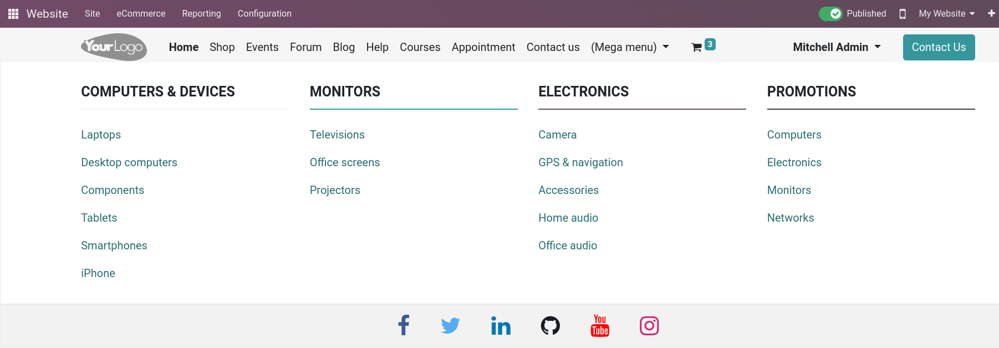

=====
Menus
=====

Menus are useful to navigate through the different content of your website. Odoo allows you to
customize these menus to best fit your website.

Menu editor
===========

You can customize the menu of your website **header** by going to :menuselection:`Website --> Site
--> Menu Editor`. From here, you can **rename** the header menu items, **delete** them, change the
**order**, or make an existing menu items the sub-menu of another item by dragging it to the right,
underneath its parent menu.

You can also create new menu items by clicking :guilabel:`Add Menu Item`. When creating a new menu
item, you are prompted to enter :guilabel:`Name` and :guilabel:`Url or Email`; click :guilabel:`OK`
when done.

Another option is the use of **mega menu**. Mega menus are similar to regular menu items found in
the header, but mega menus themselves contain a list of menu items. To create one, go to
:menuselection:`Website --> Site --> Menu Editor`, click :guilabel:`Add Mega Menu Item`, enter a
:guilabel:`Name`, and click :guilabel:`OK`.

Once created, the mega menu item can be found in the header, and its list of menu items accessed by
clicking on it.

.. tip::
   Using `/` in the :guilabel:`URL` field allows you to search for an existing page of your website.

Customization
-------------

Menu items and mega menus can be :ref:`customized <website/customization>` according to your website
needs and style. When in **edit mode** click on a menu or mega menu items to change the appearance,
URL, etc.
